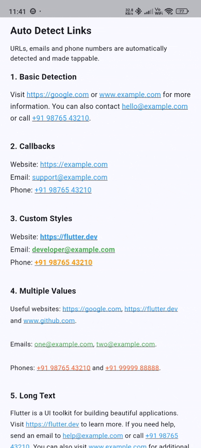

# flutter_autodetect_links_emails_phone

[](https://flutter.dev)
[](https://opensource.org/licenses/MIT)
[](#)

**flutter_autodetect_links_emails_phone** is a premium, highly customizable, and lightweight Flutter package to automatically detect and make clickable URLs, emails, and phone numbers in any text string. It features real-time parsing, custom styling per detected type, interactive tap callbacks, and zero memory leaks.

---

## 📷 Preview

<p align="center">
  
</p>

*A premium interactive text detection widget featuring real-time URL, email, and phone number recognition, custom clickable styles, and tap callbacks.*

---

## ✨ Features

- **🌐 Automatic URL Detection**
  - Detects `http://`, `https://`, and `www.` web links seamlessly.
  - Smartly handles trailing punctuation (periods, commas, colons, brackets) without breaking links.
- **✉️ Real-time Email Recognition**
  - Parses standard email addresses (e.g. `support@example.com`, `user@domain.co.uk`) and makes them interactive.
- **📞 Smart Phone Number Detection**
  - Supports international and local phone number formats (including `+91 98765 43210`, `98765 43210`, `123-456-7890`, `+1 (123) 456-7890`).
  - Intelligent filtering to exclude false positives like ISO dates (`2026-08-27`) and version numbers (`1.0.0`).
- **🎨 High-Fidelity Custom Styling**
  - Customize styles independently for links (`linkStyle`), emails (`emailStyle`), and phone numbers (`phoneStyle`).
  - Merges seamlessly with base text styles (`fontSize`, `fontWeight`, `fontFamily`) without resetting layout parameters.
- **⚡ Tap Callbacks & Handlers**
  - Dedicated callbacks (`onUrlTap`, `onEmailTap`, `onPhoneTap`) to handle custom app logic or trigger external launchers.
- **🔒 Memory Safe & Production Ready**
  - Lifecycle-managed `TapGestureRecognizer` instances to ensure zero memory leaks upon rebuilds or screen transitions.

---

## 📦 Installation

To use this package in your Flutter project, add it to your `pubspec.yaml` dependencies:

```yaml
dependencies:
  flutter:
    sdk: flutter
  # From pub.dev
  flutter_autodetect_links_emails_phone: ^0.0.1
```

Or reference it directly from a Git repository:

```yaml
dependencies:
  flutter_autodetect_links_emails_phone:
    git:
      url: https://github.com/your_username/flutter_autodetect_links_emails_phone.git
      ref: main
```

---

## 🚀 Usage

Import the package in your Dart code:

```dart
import 'package:flutter_autodetect_links_emails_phone/flutter_autodetect_links_emails_phone.dart';
```

### 1. Simple Basic Detection
By default, URLs, emails, and phone numbers are automatically styled as clickable links.

```dart
const AutoDetectText(
  'Visit https://google.com or contact support@example.com or call +91 98765 43210.',
  style: TextStyle(fontSize: 16, height: 1.5),
)
```

### 2. Detection with Tap Callbacks
Handle tap actions for URLs, emails, and phone numbers separately.

```dart
AutoDetectText(
  'Website: https://example.com\n'
  'Email: support@example.com\n'
  'Phone: +91 98765 43210',
  style: const TextStyle(fontSize: 16, height: 1.8),
  onUrlTap: (url) {
    print('URL Tapped: $url');
  },
  onEmailTap: (email) {
    print('Email Tapped: $email');
  },
  onPhoneTap: (phone) {
    print('Phone Tapped: $phone');
  },
)
```

### 3. Custom Distinct Styles
Apply distinct colors, font weights, and text decorations for each detected type.

```dart
AutoDetectText(
  'Website: https://flutter.dev\n'
  'Email: developer@example.com\n'
  'Phone: +91 98765 43210',
  style: const TextStyle(fontSize: 16, color: Colors.black87),
  linkStyle: const TextStyle(
    color: Colors.blue,
    fontWeight: FontWeight.bold,
    decoration: TextDecoration.underline,
  ),
  emailStyle: const TextStyle(
    color: Colors.green,
    fontWeight: FontWeight.bold,
    decoration: TextDecoration.underline,
  ),
  phoneStyle: const TextStyle(
    color: Colors.orange,
    fontWeight: FontWeight.bold,
    decoration: TextDecoration.underline,
  ),
)
```

### 4. Layout Controls (Alignment, Max Lines & Overflow)
Full support for text layout options just like standard Flutter `Text` widgets.

```dart
AutoDetectText(
  'Check https://flutter.dev for documentation or email support@example.com',
  textAlign: TextAlign.center,
  maxLines: 2,
  overflow: TextOverflow.ellipsis,
)
```

---

## 🛠️ API Reference

### `AutoDetectText` properties:

| Property | Type | Default | Description |
| :--- | :--- | :--- | :--- |
| `text` | `String` | *(required)* | Plain text content to parse and display. |
| `style` | `TextStyle?` | `null` | Base style for non-link text. |
| `linkStyle` | `TextStyle?` | `Blue & Underline` | Custom text style for detected web URLs. |
| `emailStyle` | `TextStyle?` | `Blue & Underline` | Custom text style for detected email addresses. |
| `phoneStyle` | `TextStyle?` | `Blue & Underline` | Custom text style for detected phone numbers. |
| `onUrlTap` | `ValueChanged<String>?` | `null` | Callback function triggered when a URL is tapped. |
| `onEmailTap` | `ValueChanged<String>?` | `null` | Callback function triggered when an email is tapped. |
| `onPhoneTap` | `ValueChanged<String>?` | `null` | Callback function triggered when a phone number is tapped. |
| `textAlign` | `TextAlign` | `TextAlign.start` | How the text should be aligned horizontally. |
| `maxLines` | `int?` | `null` | Maximum number of lines for the text to span. |
| `overflow` | `TextOverflow` | `TextOverflow.clip` | How visual overflow should be handled. |

---

## 📄 License

```lic
MIT License

Copyright (c) 2026 Excelsior Technologies

Permission is hereby granted, free of charge, to any person obtaining a copy
of this software and associated documentation files (the "Software"), to deal
in the Software without restriction, including without limitation the rights
to use, copy, modify, merge, publish, distribute, sublicense, and/or sell
copies of the Software, and to permit persons to whom the Software is
furnished to do so, subject to the following conditions:

The above copyright notice and this permission notice shall be included in all
copies or substantial portions of the Software.

THE SOFTWARE IS PROVIDED "AS IS", WITHOUT WARRANTY OF ANY KIND, EXPRESS OR
IMPLIED, INCLUDING BUT NOT LIMITED TO THE WARRANTIES OF MERCHANTABILITY,
FITNESS FOR A PARTICULAR PURPOSE AND NONINFRINGEMENT. IN NO EVENT SHALL THE
AUTHORS OR COPYRIGHT HOLDERS BE LIABLE FOR ANY CLAIM, DAMAGES OR OTHER
LIABILITY, WHETHER IN AN ACTION OF CONTRACT, TORT OR OTHERWISE, ARISING FROM,
OUT OF OR IN CONNECTION WITH THE SOFTWARE OR THE USE OR OTHER DEALINGS IN THE
SOFTWARE.
```
